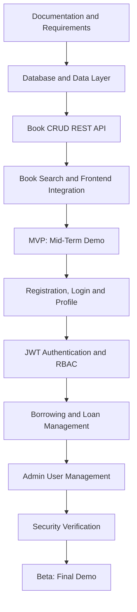

# Product Requirements Document (PRD) — LibraryNest

| **Field**    | **Value**                                                                                            |
| ------------ | ---------------------------------------------------------------------------------------------------- |
| Product      | LibraryNest                                                                                          |
| Version      | MVP + Beta                                                                                           |
| Releases     | MVP — Mid-term, Beta — Final                                                                         |
| Status       | Draft                                                                                                |
| Related docs | [Software Requirements Specification (SRS)](02-srs.md), [Technical Design Document (TDD)](03-tdd.md) |

This document covers **both releases**. Every goal, feature, and user story is marked with its release so that the functionality planned for the mid-term and final demonstrations is clearly separated.

## Documents in this set

| **Short form** | **Full form**                       | **Purpose**                                                 | **File**               |
| -------------- | ----------------------------------- | ----------------------------------------------------------- | ---------------------- |
| PRD            | Product Requirements Document       | What we build and why                                       | [01-prd.md](01-prd.md) |
| SRS            | Software Requirements Specification | Detailed requirements, permissions, and acceptance criteria | [02-srs.md](02-srs.md) |
| TDD            | Technical Design Document           | Architecture, data model, API, and implementation design    | [03-tdd.md](03-tdd.md) |

## 0. Release plan

| **Release** | **When** | **Focus**                                                                                                                   |
| ----------- | -------- | --------------------------------------------------------------------------------------------------------------------------- |
| **MVP**     | Mid-term | Core book CRUD REST API, book search, database integration, and basic frontend-backend integration                          |
| **Beta**    | Final    | Authentication, user profiles, role-based authorization, borrowing workflows, admin user management, and security hardening |

## 1. Purpose

LibraryNest is a web-based library management system that organizes book information and borrowing activities in one place.

The project will be developed in two releases:

1. **MVP (mid-term):** Deliver a working book management system with book CRUD operations, search, database integration, and REST API endpoints.
2. **Beta (final):** Extend the MVP with user accounts, authentication, role-based permissions, borrowing workflows, and administrative user management.

The project will prioritize a small, working, demonstrable MVP before introducing the more complex Beta features.

## 2. Problem statement

Students need a convenient way to discover library books and access relevant book information. Librarians need a structured way to maintain book records, review borrowing requests, and track returned books. Administrators need to manage user access securely.

Without a centralized system, book information and borrowing records can become difficult to maintain, search, and verify.

LibraryNest addresses these needs through a searchable book catalog, structured database records, and controlled borrowing workflows.

## 3. Goals

| **ID** | **Goal**                                                                               | **Release** |
| ------ | -------------------------------------------------------------------------------------- | ----------- |
| G-01   | Provide REST API endpoints for creating, reading, updating, and deleting book records. | MVP         |
| G-02   | Store book information in a relational database.                                       | MVP         |
| G-03   | Allow users to search for books by title or author.                                    | MVP         |
| G-04   | Provide clear validation errors and appropriate HTTP status codes.                     | MVP         |
| G-05   | Integrate the book management API with the frontend.                                   | MVP         |
| G-06   | Allow users to register, log in, and manage their basic profile.                       | Beta        |
| G-07   | Protect user-specific functionality through authentication and authorization.          | Beta        |
| G-08   | Enforce Student, Librarian, and Admin roles.                                           | Beta        |
| G-09   | Allow students to request loans and view their own loan history.                       | Beta        |
| G-10   | Allow librarians to approve or reject requests and manage returns.                     | Beta        |
| G-11   | Allow admins to manage users and assign roles.                                         | Beta        |
| G-12   | Protect private records and prevent unauthorized operations.                           | Beta        |

## 4. Target users

| **User**              | **Need**                                                               | **Release** |
| --------------------- | ---------------------------------------------------------------------- | ----------- |
| Student / end user    | Browse the book catalog and search for relevant books.                 | MVP         |
| Librarian             | Create, view, update, and delete book records.                         | MVP         |
| Frontend developer    | Use documented REST API endpoints to integrate the user interface.     | MVP         |
| Instructor / reviewer | Review the project and verify the book management API.                 | MVP         |
| Registered student    | Log in, request book loans, and view personal loan history.            | Beta        |
| Librarian             | Review borrowing requests, approve or reject them, and record returns. | Beta        |
| Admin                 | Manage users, assign roles, and control access to the application.     | Beta        |

In the **MVP**, the system focuses on the book catalog and book management. In the **Beta**, users have authenticated accounts and borrowing operations follow role-based permissions.

## 5. Scope

### In scope — MVP (mid-term)

* Create, list, view, update, and delete book records.
* Search books by title or author.
* Store book information in a relational database.
* Validate required book fields and reject invalid input.
* Return clear API error responses.
* Provide REST API endpoints for frontend integration.
* Implement basic frontend pages for the book catalog and book management.
* Demonstrate the working book management workflow.

### In scope — Beta (final)

* **Authentication:** User registration, login, and logout.
* **User profile:** View profile and update basic profile information.
* **Authorization:** Student, Librarian, and Admin roles with backend permission checks.
* **Personal loan history:** Students can view their own borrowing records.
* **Loan requests:** Students can request books.
* **Librarian workflow:** Approve or reject loan requests and record returned books.
* **Admin management:** List users and manage user roles.
* **Security:** Secure password storage, protected endpoints, input validation, and access control.
* **Integration:** Connect the frontend with authenticated APIs and borrowing workflows.

### Out of scope for this semester

* Online payment processing and fine payment gateways.
* AI-based book recommendations.
* Native Android or iOS applications.
* Integration with external library networks.
* Email or SMS notification services.
* Advanced analytics beyond basic administrative information.
* Automated tests and CI/CD pipelines, unless required separately by the course.

## 6. Features and priority (MoSCoW)

Priorities are per release: a Beta Must Have feature is required for the final demonstration, not necessarily for the mid-term.

| **ID** | **Feature**                                        | **Release** | **Priority** |
| ------ | -------------------------------------------------- | ----------- | ------------ |
| F-01   | Create a book record                               | MVP         | Must         |
| F-02   | List books and view book details                   | MVP         | Must         |
| F-03   | Update a book record                               | MVP         | Must         |
| F-04   | Delete a book record                               | MVP         | Must         |
| F-05   | Search books by title or author                    | MVP         | Must         |
| F-06   | Database integration for book records              | MVP         | Must         |
| F-07   | Input validation and API error responses           | MVP         | Must         |
| F-08   | Basic frontend integration with book APIs          | MVP         | Should       |
| F-09   | User registration and login                        | Beta        | Must         |
| F-10   | User profile viewing and updating                  | Beta        | Should       |
| F-11   | JWT-based authentication                           | Beta        | Must         |
| F-12   | Student, Librarian, and Admin roles                | Beta        | Must         |
| F-13   | Backend role-based permission checks               | Beta        | Must         |
| F-14   | Student borrowing requests                         | Beta        | Must         |
| F-15   | Student personal loan history                      | Beta        | Must         |
| F-16   | Librarian approval and rejection of loan requests  | Beta        | Must         |
| F-17   | Book return management                             | Beta        | Must         |
| F-18   | Admin user listing and role management             | Beta        | Must         |
| F-19   | Security hardening and access-control verification | Beta        | Must         |
| F-20   | Additional catalog filters                         | Beta        | Could        |
| F-21   | Basic administrative summaries                     | Beta        | Could        |

## 7. User stories

### MVP

| **ID**      | **Story**                                                                                                         | **Feature** |
| ----------- | ----------------------------------------------------------------------------------------------------------------- | ----------- |
| US-01 (MVP) | As a user, I want to view all books so that I can discover books available in the library.                        | F-02        |
| US-02 (MVP) | As a user, I want to view an individual book so that I can read its details.                                      | F-02        |
| US-03 (MVP) | As a user, I want to search books by title or author so that I can find a relevant book quickly.                  | F-05        |
| US-04 (MVP) | As a librarian, I want to add a book so that new books become available in the catalog.                           | F-01        |
| US-05 (MVP) | As a librarian, I want to update book information so that incorrect details can be corrected.                     | F-03        |
| US-06 (MVP) | As a librarian, I want to delete a book record when appropriate so that the catalog remains accurate.             | F-04        |
| US-07 (MVP) | As a developer, I want validated API requests and clear errors so that the frontend can handle failures properly. | F-07        |
| US-08 (MVP) | As an instructor, I want to verify the book API so that I can review the core project functionality.              | F-01–F-08   |

### Beta

| **ID**       | **Story**                                                                                                                | **Feature**      |
| ------------ | ------------------------------------------------------------------------------------------------------------------------ | ---------------- |
| US-09 (Beta) | As a visitor, I want to register so that I can create my own account.                                                    | F-09             |
| US-10 (Beta) | As a registered user, I want to log in and log out so that I can access my account securely.                             | F-09, F-11       |
| US-11 (Beta) | As a user, I want to view and update my profile so that my basic account information stays current.                      | F-10             |
| US-12 (Beta) | As a student, I want to request a book loan so that I can borrow a book from the library.                                | F-14             |
| US-13 (Beta) | As a student, I want to view my own loan history so that I can track my borrowing activity.                              | F-15             |
| US-14 (Beta) | As a librarian, I want to approve or reject loan requests so that borrowing can be managed properly.                     | F-16             |
| US-15 (Beta) | As a librarian, I want to record returned books so that loan records and availability remain accurate.                   | F-17             |
| US-16 (Beta) | As an admin, I want to list users and assign roles so that system access can be managed.                                 | F-18             |
| US-17 (Beta) | As a system administrator, I want protected endpoints to enforce permissions so that unauthorized actions are prevented. | F-12, F-13, F-19 |
| US-18 (Beta) | As a student, I want my loan records to remain private so that other students cannot view my personal borrowing history. | F-13, F-15, F-19 |

## 8. Success metrics

### MVP

* All five core book operations—create, list/view, retrieve details, update, and delete—pass the documented manual verification scenarios.
* Book search returns matching records for the documented title and author search scenarios.
* All documented invalid-input scenarios are rejected with appropriate error responses.
* Book data can be created, retrieved, and updated through the backend API.
* The frontend can complete the defined MVP book workflows using the backend API.
* The MVP is ready for the mid-term demonstration.

### Beta

* Valid users can authenticate, and invalid login attempts are rejected.
* All documented role-permission scenarios pass verification.
* Students cannot read or modify another student's private loan history.
* Librarians can approve or reject requests and record book returns.
* Only authorized admins can manage user accounts and roles.
* Passwords are never stored or returned in plaintext.
* All defined Must Have Beta workflows are ready for the final demonstration.

These are target metrics; actual results will be recorded during implementation and verification.

## 9. Assumptions and constraints

* The project will use a web-based architecture.
* The backend will expose REST API endpoints.
* A relational database will store book, user, and loan records.
* The frontend and backend will communicate through the defined API contracts.
* **MVP:** Core book management will be completed before advanced Beta functionality.
* **Beta:** Protected operations will enforce authorization on the backend.
* Students, Librarians, and Admins will have distinct permissions.
* The project must remain within the semester timeline and course requirements.
* The exact deployment configuration and technology versions will be specified in the TDD.

## 10. Milestones

### MVP — Mid-term

| **Milestone**      | **Deliverable**                                      |
| ------------------ | ---------------------------------------------------- |
| M1 — Docs          | PRD, SRS, and TDD covering MVP and Beta              |
| M2 — Data layer    | Book model, database schema, and database connection |
| M3 — API           | Book CRUD REST endpoints with validation             |
| M4 — Search        | Book search by title or author                       |
| M5 — Integration   | Basic frontend integration with the book API         |
| M6 — Mid-term demo | Working MVP book management workflow demonstrated    |

### Beta — Final

| **Milestone**           | **Deliverable**                                                       |
| ----------------------- | --------------------------------------------------------------------- |
| B1 — Authentication     | Registration, login, logout, and profile functionality                |
| B2 — RBAC               | Student, Librarian, and Admin roles with protected endpoints          |
| B3 — Loan requests      | Student borrowing requests and personal loan history                  |
| B4 — Librarian workflow | Request approval/rejection and book return management                 |
| B5 — Admin management   | User listing and role management                                      |
| B6 — Security           | Password protection, input validation, and authorization verification |
| B7 — Final demo         | Integrated Beta demonstrated with the defined role-based workflows    |

## 11. Release dependencies

* The Beta builds on the MVP book catalog and database layer.
* The book model must be defined before implementing the book CRUD endpoints.
* The API contracts must be stable enough for frontend integration.
* **Beta:** Authentication must be implemented before protected user-specific endpoints.
* **Beta:** Role definitions and permission rules must be established before loan and admin operations are exposed.
* **Beta:** The loan data model must connect students and books before borrowing workflows can be implemented.
* **Beta:** Book availability and loan status rules must be defined before approval and return management.
* **Beta:** All protected endpoints must enforce backend authorization rather than relying only on frontend visibility.

## 12. Related requirements and design

The Software Requirements Specification (SRS) will define detailed functional requirements, non-functional requirements, use cases, role permissions, validation rules, status codes, acceptance criteria, and requirement-to-endpoint traceability.

The Technical Design Document (TDD) will describe the technology stack, architecture, project structure, database schema, API endpoints, authentication, authorization, security design, and deployment approach.

## 13. Review and approval

**Status:** Draft

This PRD defines the intended scope, release priorities, user stories, success metrics, milestones, and dependencies for LibraryNest. The document should be reviewed against the course requirements and approved before implementation begins.
