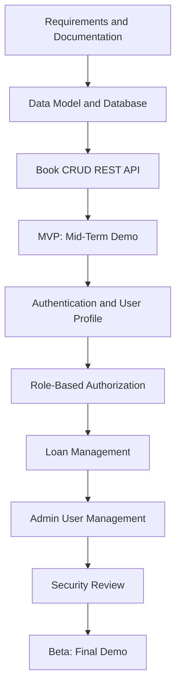

# Product Requirements Document (PRD) — LibraryNest

## 1. Project Overview

**Project Name:** LibraryNest
**Document:** Product Requirements Document (PRD)
**Project Type:** Web-Based Library Management System

LibraryNest is a web-based library management system designed to simplify book discovery, book inventory management, and book borrowing workflows. It provides a centralized platform where students can search for books and request loans, librarians can manage books and borrowing requests, and administrators can manage users and system access.

The project will be developed in two releases: MVP for the mid-term demonstration and Beta for the final demonstration.

## 2. Problem Statement

Traditional library management may rely on manual records or disconnected processes to manage books, borrowing requests, and user information. These processes can make book discovery difficult, increase administrative workload, and create opportunities for inaccurate records.

LibraryNest aims to organize these activities through a web application with a centralized database and REST API.

* **MVP:** Provide core book management and search functionality through REST APIs.
* **Beta:** Introduce authentication, role-based authorization, borrowing workflows, and administrative user management.

## 3. Goals and Objectives

### MVP Goals

* **MVP:** Allow users to retrieve and search book information.
* **MVP:** Support creating, viewing, updating, and deleting book records.
* **MVP:** Store book information in a database.
* **MVP:** Provide a REST API that can be integrated with the frontend.

### Beta Goals

* **Beta:** Allow users to register and log in securely.
* **Beta:** Enforce role-based access control for Students, Librarians, and Admins.
* **Beta:** Allow students to submit borrowing requests and view their own loan history.
* **Beta:** Allow librarians to approve or reject borrowing requests and manage returns.
* **Beta:** Allow administrators to manage user accounts and roles.
* **Beta:** Protect private information and prevent unauthorized access.

## 4. Target Users

| User Role | Description                                                                               |
| --------- | ----------------------------------------------------------------------------------------- |
| Student   | Searches for books, views book details, requests loans, and checks personal loan history. |
| Librarian | Manages book records, reviews borrowing requests, and records book returns.               |
| Admin     | Manages user accounts, assigns roles, and oversees system access.                         |

## 5. Release Plan and Roadmap

LibraryNest will be developed incrementally, beginning with core book management and expanding to secure, role-based library workflows.

### MVP — Mid-Term Release

The MVP focuses on the essential book catalog and book management functionality.

**Included features:**

* Book creation, retrieval, updating, and deletion.
* Search by book title or author.
* Database integration.
* REST API endpoints.
* Input validation and appropriate HTTP status codes.
* Basic frontend-backend integration.

**Milestones:**

1. Complete the project documentation.
2. Design the database and implement the data layer.
3. Implement and verify book CRUD APIs.
4. Integrate the frontend with the backend.
5. Prepare and demonstrate the MVP before the mid-term assessment.

### Beta — Final Release

The Beta release extends the MVP with authentication, authorization, borrowing workflows, and administrative features.

**Included features:**

* User registration and login.
* JWT-based authentication.
* Student, Librarian, and Admin roles.
* Role-based authorization and protected API endpoints.
* Borrowing request creation and management.
* Loan history for individual students.
* Book return management.
* Administrative user and role management.
* Security hardening and error handling.

**Milestones:**

1. Implement authentication and user profile management.
2. Implement role-based permissions.
3. Develop borrowing, approval, and return workflows.
4. Add administrative user management.
5. Review security and validate authorization rules.
6. Prepare and demonstrate the Beta release before the final assessment.

## 6. Scope

### In Scope

**MVP**

* Book CRUD operations.
* Book catalog retrieval and search.
* Database integration.
* REST API development.
* Input validation and error responses.

**Beta**

* Registration and login.
* JWT-based authentication.
* Role-based authorization.
* Student loan history.
* Borrowing request approval and rejection.
* Book return management.
* Admin user and role management.
* Access control and security improvements.

### Out of Scope

* **MVP and Beta:** Online payment processing.
* **MVP and Beta:** AI-based book recommendations.
* **MVP and Beta:** Native Android or iOS applications.
* **MVP and Beta:** Integration with external library networks.
* **MVP and Beta:** Advanced analytics beyond basic administrative summaries.

## 7. Feature Prioritization — MoSCoW

MoSCoW prioritization classifies features as Must Have, Should Have, Could Have, or Won't Have for the current project scope.

| ID   | Feature                                     | Priority    | Release               |
| ---- | ------------------------------------------- | ----------- | --------------------- |
| F-01 | Create book records                         | Must Have   | MVP                   |
| F-02 | View book lists and details                 | Must Have   | MVP                   |
| F-03 | Update and delete book records              | Must Have   | MVP                   |
| F-04 | Search books by title or author             | Must Have   | MVP                   |
| F-05 | Database integration                        | Must Have   | MVP                   |
| F-06 | Input validation and API error handling     | Must Have   | MVP                   |
| F-07 | User registration and login                 | Must Have   | Beta                  |
| F-08 | JWT authentication                          | Must Have   | Beta                  |
| F-09 | Role-based authorization                    | Must Have   | Beta                  |
| F-10 | Student borrowing requests and loan history | Must Have   | Beta                  |
| F-11 | Librarian approval and return management    | Must Have   | Beta                  |
| F-12 | Admin user and role management              | Must Have   | Beta                  |
| F-13 | Additional catalog filters                  | Should Have | Beta, if time permits |
| F-14 | Basic administrative summaries              | Could Have  | Beta, if time permits |
| F-15 | Online payments and AI recommendations      | Won't Have  | Out of scope          |

## 8. User Stories

### MVP User Stories

* **US-01 (MVP):** As a user, I want to view the book catalog so that I can discover available books.
* **US-02 (MVP):** As a user, I want to search books by title or author so that I can find relevant books quickly.
* **US-03 (MVP):** As a librarian, I want to add new books so that the catalog stays up to date.
* **US-04 (MVP):** As a librarian, I want to update book details so that incorrect information can be corrected.
* **US-05 (MVP):** As a librarian, I want to delete outdated book records so that the catalog remains accurate.
* **US-06 (MVP):** As a developer, I want validated REST API endpoints so that the frontend can communicate reliably with the backend.

### Beta User Stories

* **US-07 (Beta):** As a student, I want to register and log in so that I can access my personal library features.
* **US-08 (Beta):** As a user, I want to update my profile information so that my account details remain current.
* **US-09 (Beta):** As a student, I want to request a book loan so that I can borrow books from the library.
* **US-10 (Beta):** As a student, I want to view my own loan history so that I can track my borrowing activity.
* **US-11 (Beta):** As a librarian, I want to approve or reject loan requests so that borrowing is properly managed.
* **US-12 (Beta):** As a librarian, I want to record returned books so that availability information remains accurate.
* **US-13 (Beta):** As an admin, I want to manage user accounts and roles so that system access is controlled.
* **US-14 (Beta):** As a system administrator, I want protected endpoints to enforce permissions so that users cannot perform unauthorized actions.

## 9. Success Metrics

### MVP Success Metrics

* **MVP:** 100% of defined book CRUD API operations pass the documented manual verification scenarios.
* **MVP:** Users can retrieve book records and search by title or author.
* **MVP:** All required book fields are validated, and invalid requests return appropriate error responses.
* **MVP:** The frontend can retrieve and display book data through the backend API.
* **MVP:** The core book management workflow is demonstrated before the mid-term assessment.

### Beta Success Metrics

* **Beta:** Successful login returns valid authentication credentials, and invalid credentials are rejected.
* **Beta:** 100% of documented role-permission scenarios behave as expected.
* **Beta:** Students can access their own loan history but cannot access another student's private loan records.
* **Beta:** Librarians can approve or reject requests and record returns.
* **Beta:** Admins can manage user accounts and roles through protected endpoints.
* **Beta:** The complete borrowing workflow is demonstrated before the final assessment.

## 10. Assumptions and Constraints

* The application will use a web-based architecture.
* The backend will expose REST APIs.
* A relational database will store books, users, and loans.
* The frontend and backend will be developed as separate components.
* Authentication and role-based authorization are Beta requirements.
* The project must remain within the semester timeline and course requirements.
* The final technology stack will be documented in the Technical Design Document (TDD).

## 11. Dependencies and Risks

| Risk                                     | Impact                            | Mitigation                                                          |
| ---------------------------------------- | --------------------------------- | ------------------------------------------------------------------- |
| Database design errors                   | Incorrect or inconsistent records | Review the data model before implementation.                        |
| Authentication or authorization mistakes | Unauthorized data access          | Verify protected endpoints for each role.                           |
| Scope expansion                          | Delays in milestone completion    | Prioritize Must Have features first.                                |
| Frontend-backend integration issues      | Incomplete user workflows         | Define API contracts early and verify them during integration.      |
| Insufficient time for Beta features      | Incomplete final demonstration    | Complete and demonstrate the MVP before starting advanced features. |

## 12. Related Documents

* [Software Requirements Specification (SRS)](02-srs.md)
* [Technical Design Document (TDD)](03-tdd.md)
* [Project README](../README.md)

## 13. Approval

This PRD defines the planned scope, priorities, user stories, and success criteria for the MVP and Beta releases of LibraryNest. The requirements should be reviewed and approved before implementation begins.
