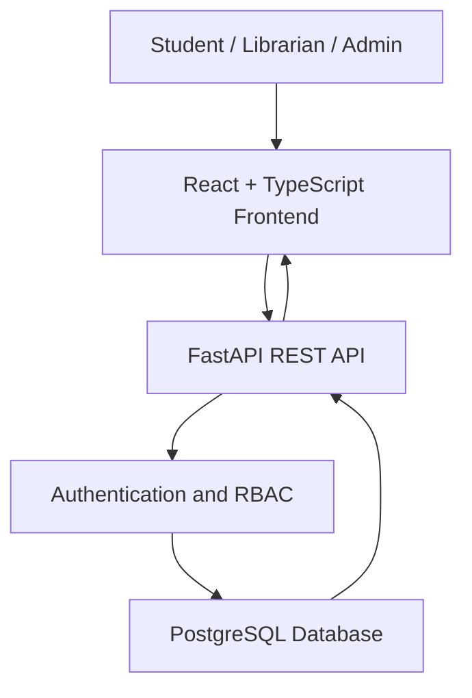
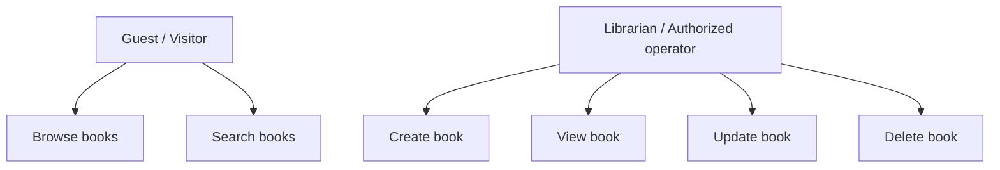
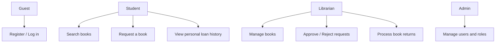
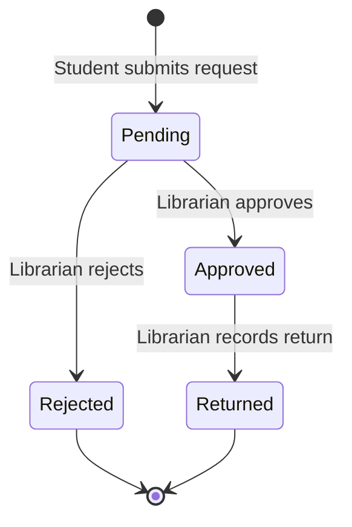

# Software Requirements Specification (SRS) — LibraryNest

| **Field**    | **Value**                                                                                      |
| ------------ | ---------------------------------------------------------------------------------------------- |
| Product      | LibraryNest                                                                                    |
| Version      | MVP + Beta                                                                                     |
| Releases     | MVP — Mid-term, Beta — Final                                                                   |
| Status       | Draft                                                                                          |
| Related docs | [Product Requirements Document (PRD)](01-prd.md), [Technical Design Document (TDD)](03-tdd.md) |

Every requirement has a **Release** column: **MVP** is developed for the mid-term, and **Beta** adds the remaining features for the final.

## Documents in this set

| Short form | Full form                           | Purpose                                                 | File                   |
| ---------- | ----------------------------------- | ------------------------------------------------------- | ---------------------- |
| PRD        | Product Requirements Document       | What we build and why                                   | [01-prd.md](01-prd.md) |
| SRS        | Software Requirements Specification | Exact requirements, permissions and acceptance criteria | [02-srs.md](02-srs.md) |
| TDD        | Technical Design Document           | Architecture, database design and API details           | [03-tdd.md](03-tdd.md) |

## 1. Introduction

### 1.1 Purpose

This document specifies the functional and non-functional requirements for LibraryNest. The MVP focuses on book management and search. The Beta adds authentication, role-based permissions, borrowing requests, loan history, returns and administration.

### 1.2 Scope

* **MVP:** Users can browse and search books. The system supports creating, viewing, updating and deleting book records through REST APIs, with database integration and input validation.
* **Beta:** Users can register and log in. Students can request books and view their loan history. Librarians can approve or reject requests and manage returns. Admins can manage users and roles.
* **Out of scope:** Online payments, AI recommendations, native mobile applications, external library integrations and email/SMS notifications. See [PRD, Section 5](01-prd.md#5-scope).

### 1.3 Definitions

| Term           | Meaning                                                                |
| -------------- | ---------------------------------------------------------------------- |
| CRUD           | Create, Read, Update and Delete                                        |
| REST           | An API style that uses HTTP methods to access resources                |
| API            | Application Programming Interface                                      |
| Book           | A record containing a book's title, author and other details           |
| Student        | A registered user who can request books and view personal loan records |
| Librarian      | A user who manages borrowing requests and book returns                 |
| Admin          | A user who manages user accounts and roles                             |
| Authentication | Verifying the identity of a user                                       |
| Authorization  | Checking what an authenticated user is allowed to do                   |
| RBAC           | Role-Based Access Control: permissions depend on the user's role       |
| JWT            | JSON Web Token used to represent authenticated identity                |
| Loan           | A record of a book borrowing request and its status                    |
| FastAPI        | Python framework used to build the backend REST API                    |
| OpenAPI        | A standard description of API endpoints and schemas                    |

## 2. Overall description

### 2.1 System context

LibraryNest is a web-based library management system. The React + TypeScript frontend communicates with the FastAPI backend through REST APIs. The backend validates requests, checks permissions and reads or writes data in PostgreSQL.

### 2.2 Users and roles

| Role      | Release    | Description                                                                       |
| --------- | ---------- | --------------------------------------------------------------------------------- |
| Guest     | MVP + Beta | Can browse and search books. In Beta, can register and log in.                    |
| Student   | Beta       | Can search books, submit borrowing requests and view personal loan history.       |
| Librarian | Beta       | Can manage book records, review borrowing requests and process returns.           |
| Admin     | Beta       | Can manage user accounts and roles and perform authorized administrative actions. |

Student, Librarian and Admin are global roles assigned to authenticated accounts. Each protected API endpoint must verify the caller's permissions on the backend.

### 2.3 Use cases

**MVP**

**Beta**

### 2.4 Constraints

* C-01: The frontend shall use React with TypeScript.
* C-02: The backend shall use Python with FastAPI.
* C-03: Frontend-backend communication shall use REST APIs.
* C-04: API request and response bodies shall use JSON where applicable.
* C-05: PostgreSQL shall store persistent application data.
* C-06: Authentication and authorization shall be enforced by the backend.
* C-07: API documentation shall be available through FastAPI's OpenAPI documentation.
* C-08: The application shall implement the requirements specified for the MVP and Beta releases.

### 2.5 Assumptions

* A-01: Users have access to a modern web browser and an internet connection.
* A-02: The system is intended for academic demonstration and library-management use.
* A-03: Book records and user accounts are maintained by authorized users.
* A-04: A borrowing request does not mean a book has been issued until the librarian approves it.
* A-05: The initial admin account will be created through a controlled setup process.
* A-06: Deployment details and environment variables will be documented in the TDD.

## 3. Functional requirements

### 3.1 Book management — MVP

| ID    | Requirement                                                                                                                          | Release | Story       |
| ----- | ------------------------------------------------------------------------------------------------------------------------------------ | ------- | ----------- |
| FR-01 | The system shall create a book record containing a title and author, with optional ISBN, category, publication year and description. | MVP     | US-01       |
| FR-02 | The system shall return a list of available book records.                                                                            | MVP     | US-02       |
| FR-03 | The system shall return a single book by its ID.                                                                                     | MVP     | US-03       |
| FR-04 | The system shall update the editable fields of an existing book without changing fields that were not submitted.                     | MVP     | US-04       |
| FR-05 | The system shall delete an existing book record when an authorized request is received.                                              | MVP     | US-05       |
| FR-06 | The system shall allow users to search books by title or author.                                                                     | MVP     | US-06       |
| FR-07 | The system shall validate required fields and reject invalid input with a descriptive error response.                                | MVP     | US-01–US-06 |
| FR-08 | The system shall return `404 Not Found` when a requested book ID does not exist.                                                     | MVP     | US-03–US-05 |
| FR-09 | The system shall store book records in PostgreSQL so that they persist after application restarts.                                   | MVP     | US-01–US-05 |
| FR-10 | The system shall provide interactive API documentation through FastAPI's documentation endpoint.                                     | MVP     | US-07       |
| FR-11 | The system shall provide a health endpoint that reports whether the API is responding.                                               | MVP     | US-07       |

### 3.2 Authentication and profile — Beta

| ID    | Requirement                                                                                                                                  | Release | Story |
| ----- | -------------------------------------------------------------------------------------------------------------------------------------------- | ------- | ----- |
| FR-12 | The system shall allow a guest to register with a name, email and password.                                                                  | Beta    | US-08 |
| FR-13 | The system shall reject registration when the email is already registered.                                                                   | Beta    | US-08 |
| FR-14 | The system shall allow registered users to log in with valid credentials and receive an access token.                                        | Beta    | US-09 |
| FR-15 | The system shall reject invalid login credentials without revealing whether the email or password was incorrect.                             | Beta    | US-09 |
| FR-16 | The system shall allow an authenticated user to log out and end the current application session according to the implemented token strategy. | Beta    | US-09 |
| FR-17 | The system shall return the authenticated user's profile without exposing the password or password hash.                                     | Beta    | US-10 |
| FR-18 | The system shall protect endpoints that require authentication and return `401 Unauthorized` when the caller is not authenticated.           | Beta    | US-11 |

### 3.3 Borrowing requests and loan history — Beta

| ID    | Requirement                                                                                                  | Release | Story |
| ----- | ------------------------------------------------------------------------------------------------------------ | ------- | ----- |
| FR-19 | A student shall be able to submit a borrowing request for a book.                                            | Beta    | US-12 |
| FR-20 | The system shall record the requesting student, requested book, request date and current loan status.        | Beta    | US-12 |
| FR-21 | A student shall be able to view their own borrowing requests and loan history.                               | Beta    | US-13 |
| FR-22 | A student shall not be able to view or modify another student's private loan records.                        | Beta    | US-13 |
| FR-23 | The system shall prevent a borrowing request for a book that is not available for borrowing.                 | Beta    | US-12 |
| FR-24 | The system shall update the relevant book availability and loan record when a borrowing request is approved. | Beta    | US-14 |

### 3.4 Librarian operations — Beta

| ID    | Requirement                                                                                                        | Release | Story        |
| ----- | ------------------------------------------------------------------------------------------------------------------ | ------- | ------------ |
| FR-25 | A librarian shall be able to view pending borrowing requests.                                                      | Beta    | US-14        |
| FR-26 | A librarian shall be able to approve or reject a pending borrowing request.                                        | Beta    | US-14        |
| FR-27 | The system shall record the decision and status of each borrowing request.                                         | Beta    | US-14        |
| FR-28 | A librarian shall be able to record the return of an issued book.                                                  | Beta    | US-15        |
| FR-29 | When a book is returned, the system shall update its loan status and availability as appropriate.                  | Beta    | US-15        |
| FR-30 | Only a librarian or an admin with the required permission shall perform approval, rejection and return operations. | Beta    | US-14, US-15 |

### 3.5 User and role management — Beta

| ID    | Requirement                                                                                                            | Release | Story |
| ----- | ---------------------------------------------------------------------------------------------------------------------- | ------- | ----- |
| FR-31 | The system shall assign each registered account one global role: `student`, `librarian` or `admin`.                    | Beta    | US-16 |
| FR-32 | The system shall assign the `student` role by default during public registration.                                      | Beta    | US-08 |
| FR-33 | An admin shall be able to view a paginated list of user accounts.                                                      | Beta    | US-16 |
| FR-34 | An admin shall be able to change a user's role through a protected endpoint.                                           | Beta    | US-16 |
| FR-35 | A non-admin user shall receive `403 Forbidden` when attempting an admin-only action.                                   | Beta    | US-16 |
| FR-36 | Users shall not be able to change their own role by editing their profile or submitting a public registration request. | Beta    | US-16 |

### 3.6 Validation rules

| Field              | Rule                                                                | Release |
| ------------------ | ------------------------------------------------------------------- | ------- |
| `title`            | Required; non-empty string after trimming spaces                    | MVP     |
| `author`           | Required; non-empty string after trimming spaces                    | MVP     |
| `isbn`             | Optional; if provided, must follow the chosen ISBN validation rules | MVP     |
| `category`         | Optional text value                                                 | MVP     |
| `publication_year` | Optional valid year                                                 | MVP     |
| `description`      | Optional text value                                                 | MVP     |
| `name`             | Required during registration                                        | Beta    |
| `email`            | Required valid email; duplicate registrations rejected              | Beta    |
| `password`         | Required; must satisfy the application's password policy            | Beta    |
| `role`             | Must be one of `student`, `librarian` or `admin`                    | Beta    |
| `book_id`          | Must identify an existing book                                      | Beta    |
| `loan_id`          | Must identify an existing borrowing or loan record                  | Beta    |
| `loan_status`      | Must be one of the defined application states                       | Beta    |

Exact field-length limits and any additional validation rules shall be finalized in the TDD and implemented consistently in the API schemas and database.

### 3.7 Loan states — Beta

A new borrowing request shall start with `Pending`. Only a pending request may be approved or rejected. A return may be recorded only after a request has been approved and the book has been issued. The implementation shall define any additional cancellation or overdue states separately if required.

### 3.8 Permission matrix — Beta

| Action                               | Guest                 | Student | Librarian                        | Admin                                                       |
| ------------------------------------ | --------------------- | ------- | -------------------------------- | ----------------------------------------------------------- |
| Browse and search books              | Yes                   | Yes     | Yes                              | Yes                                                         |
| View book details                    | Yes                   | Yes     | Yes                              | Yes                                                         |
| Create, edit or delete book records  | No                    | No      | Yes                              | Yes                                                         |
| Register and log in                  | Yes                   | —       | —                                | —                                                           |
| View own profile                     | No                    | Yes     | Yes                              | Yes                                                         |
| Submit a borrowing request           | No                    | Yes     | No, unless separately authorized | No, unless separately authorized                            |
| View own loan history                | No                    | Yes     | No                               | No, unless an authorized administrative feature is provided |
| View pending borrowing requests      | No                    | No      | Yes                              | Yes                                                         |
| Approve or reject requests           | No                    | No      | Yes                              | Yes                                                         |
| Record book returns                  | No                    | No      | Yes                              | Yes                                                         |
| List user accounts                   | No                    | No      | No                               | Yes                                                         |
| Change user roles                    | No                    | No      | No                               | Yes                                                         |
| Access a protected API without login | Public endpoints only | No      | No                               | No                                                          |

Every permission check shall be performed on the backend. Hiding a button in the frontend shall not be considered sufficient authorization.

### 3.9 Status codes

| Case                                              | HTTP status                 | Release    |
| ------------------------------------------------- | --------------------------- | ---------- |
| Resource created                                  | `201 Created`               | MVP / Beta |
| Successful read or update                         | `200 OK`                    | MVP / Beta |
| Successful deletion with no response body         | `204 No Content`            | MVP / Beta |
| Invalid input                                     | `422 Unprocessable Entity`  | MVP / Beta |
| Missing resource or inaccessible private resource | `404 Not Found`             | MVP / Beta |
| Missing or invalid authentication                 | `401 Unauthorized`          | Beta       |
| Authenticated caller lacks permission             | `403 Forbidden`             | Beta       |
| Duplicate email or conflicting request            | `409 Conflict`              | Beta       |
| Unexpected server error                           | `500 Internal Server Error` | MVP / Beta |

The API shall return a consistent error structure and shall not expose stack traces, passwords, tokens or database credentials.

## 4. Non-functional requirements

| ID     | Category        | Requirement                                                                                                 | Release |
| ------ | --------------- | ----------------------------------------------------------------------------------------------------------- | ------- |
| NFR-01 | Performance     | Book listing and search should respond within 2 seconds under normal demonstration load.                    | MVP     |
| NFR-02 | Persistence     | Book records shall remain stored after an application restart or redeployment.                              | MVP     |
| NFR-03 | Usability       | The interface shall allow users to browse and search books without unnecessary steps.                       | MVP     |
| NFR-04 | Reliability     | Invalid requests shall produce appropriate error responses rather than crash the application.               | MVP     |
| NFR-05 | Maintainability | Frontend components, backend routes, validation schemas and database operations shall be organized clearly. | MVP     |
| NFR-06 | Documentation   | API endpoints shall be documented through OpenAPI documentation.                                            | MVP     |
| NFR-07 | Security        | Production traffic shall use HTTPS.                                                                         | MVP     |
| NFR-08 | Security        | Database credentials and secret keys shall be kept outside source code and version control.                 | MVP     |
| NFR-09 | Security        | Database access shall use parameterized queries or safe ORM operations.                                     | MVP     |
| NFR-10 | Compatibility   | The web interface shall support a modern desktop browser.                                                   | MVP     |
| NFR-11 | Security        | Passwords shall be stored using a suitable password-hashing algorithm and never as plain text.              | Beta    |
| NFR-12 | Security        | Access tokens shall be signed, expire after a configured period and be verified by the backend.             | Beta    |
| NFR-13 | Security        | Protected operations shall verify the caller's identity and permissions on every request.                   | Beta    |
| NFR-14 | Privacy         | Students shall only access their own private loan history through student-facing endpoints.                 | Beta    |
| NFR-15 | Data integrity  | Borrowing approval and book-availability updates shall not leave inconsistent records.                      | Beta    |
| NFR-16 | Data integrity  | A loan shall not be returned more than once or approved after it has been rejected.                         | Beta    |
| NFR-17 | Usability       | The interface shall provide understandable success, loading and error feedback.                             | Beta    |
| NFR-18 | Maintainability | Database schema changes shall be documented and applied through a consistent migration or setup process.    | Beta    |

Performance targets are acceptance goals for the class project, not measured results. They should be tested under a defined demonstration workload.

## 5. Acceptance criteria

### MVP

**AC-01 Create a book (FR-01, FR-07)**

* Given valid book details containing a title and author.
* When an authorized client sends `POST /api/v1/books`.
* Then the system returns `201 Created` and the saved book record, including its ID.

**AC-02 Reject invalid book data (FR-07)**

* Given a request with a missing or blank title.
* When the client sends the create-book request.
* Then the system returns `422 Unprocessable Entity` with an error identifying the invalid field.

**AC-03 List books (FR-02)**

* Given that several book records exist.
* When the client sends `GET /api/v1/books`.
* Then the system returns `200 OK` with a list of books.

**AC-04 Get a book (FR-03, FR-08)**

* Given that a book exists with ID `5`.
* When the client sends `GET /api/v1/books/5`.
* Then the system returns `200 OK` with that book.
* When the client requests a nonexistent ID.
* Then the system returns `404 Not Found`.

**AC-05 Update a book (FR-04)**

* Given that a book exists.
* When an authorized client updates its title.
* Then the system saves the new title and preserves all fields not included in the update.

**AC-06 Delete a book (FR-05)**

* Given that a deletable book exists.
* When an authorized client sends `DELETE /api/v1/books/{id}`.
* Then the system deletes the record and returns the documented success status.
* A subsequent request for that record returns `404 Not Found`.

**AC-07 Search books (FR-06)**

* Given that book records have different titles and authors.
* When a user searches by a matching title or author.
* Then the response contains the matching books and does not require an exact full-title match.

**AC-08 Health and API documentation (FR-10, FR-11)**

* When a client requests the configured health endpoint.
* Then the API returns a successful response indicating that it is running.
* When a developer opens the API documentation endpoint.
* Then the documented endpoints and their request schemas are available.

### Beta

**AC-09 Register (FR-12, FR-13, FR-32)**

* Given an email that is not registered.
* When a guest submits valid registration details.
* Then the system creates an account with the default `student` role and does not return a password or password hash.
* When the email is already registered.
* Then the system rejects the duplicate registration.

**AC-10 Log in (FR-14, FR-15)**

* Given a registered account.
* When the user submits valid credentials.
* Then the system returns a valid access token.
* When the user submits invalid credentials.
* Then the system returns `401 Unauthorized` without revealing which credential was incorrect.

**AC-11 Authentication required (FR-18)**

* Given a protected endpoint.
* When an unauthenticated client requests it.
* Then the system returns `401 Unauthorized`.

**AC-12 Student submits a request (FR-19, FR-20, FR-23)**

* Given a student and a book available for borrowing.
* When the student submits a borrowing request.
* Then the system creates a loan record with status `Pending`.
* When the book is unavailable.
* Then the system rejects the request and does not create an invalid loan record.

**AC-13 Private loan history (FR-21, FR-22)**

* Given that Student A has a loan record.
* When Student A requests their loan history.
* Then the system returns their own records.
* When Student B tries to access Student A's private record.
* Then the system denies access without exposing the private record.

**AC-14 Approve or reject a request (FR-25, FR-26, FR-27)**

* Given a pending borrowing request.
* When a librarian approves it.
* Then the system updates the request status to `Approved` and updates book availability as appropriate.
* When a librarian rejects it.
* Then the system updates the status to `Rejected`.

**AC-15 Process a return (FR-28, FR-29)**

* Given an approved loan that has been issued.
* When a librarian records the book's return.
* Then the system marks the loan as `Returned` and updates availability as appropriate.
* A repeated return operation shall not create a second return transition.

**AC-16 Librarian-only operations (FR-30)**

* Given a student account.
* When the student attempts to approve a borrowing request or record a return.
* Then the system returns `403 Forbidden`.
* When an authorized librarian performs the same operation on a valid request.
* Then the system permits the operation.

**AC-17 Admin role management (FR-33, FR-34, FR-35, FR-36)**

* Given an authenticated admin.
* When the admin requests the user list or changes a user's role.
* Then the system permits the authorized operation.
* When a student or librarian attempts the same admin-only operation.
* Then the system returns `403 Forbidden`.
* A user cannot grant themself admin privileges through public registration or profile editing.

**AC-18 Password and secret protection (NFR-08, NFR-11, NFR-12)**

* Given a registered user.
* When the account is stored or authenticated.
* Then the database does not store the plain-text password, and protected API requests validate the access token.
* Secret keys and database credentials are not committed to the repository.

## 6. Traceability

The following table maps user stories to functional requirements and API endpoints. The exact endpoint paths and request schemas shall be finalized in the TDD.

| Story                                    | Requirements                      | Endpoint (planned)                                               | Release |
| ---------------------------------------- | --------------------------------- | ---------------------------------------------------------------- | ------- |
| US-01 Create a book                      | FR-01, FR-07, FR-09               | `POST /api/v1/books`                                             | MVP     |
| US-02 Browse books                       | FR-02                             | `GET /api/v1/books`                                              | MVP     |
| US-03 View book details                  | FR-03, FR-08                      | `GET /api/v1/books/{id}`                                         | MVP     |
| US-04 Edit a book                        | FR-04                             | `PATCH /api/v1/books/{id}`                                       | MVP     |
| US-05 Delete a book                      | FR-05                             | `DELETE /api/v1/books/{id}`                                      | MVP     |
| US-06 Search books                       | FR-06                             | `GET /api/v1/books?search={query}`                               | MVP     |
| US-07 Check API health and documentation | FR-10, FR-11                      | `GET /api/health`, `/docs`                                       | MVP     |
| US-08 Register                           | FR-12, FR-13, FR-32               | `POST /api/v1/auth/register`                                     | Beta    |
| US-09 Log in and log out                 | FR-14, FR-15, FR-16               | `POST /api/v1/auth/login`, `POST /api/v1/auth/logout`            | Beta    |
| US-10 View profile                       | FR-17                             | `GET /api/v1/users/me`                                           | Beta    |
| US-11 Access protected resources         | FR-18                             | Protected API endpoints                                          | Beta    |
| US-12 Request a book                     | FR-19, FR-20, FR-23               | `POST /api/v1/loans`                                             | Beta    |
| US-13 View loan history                  | FR-21, FR-22                      | `GET /api/v1/loans/my`                                           | Beta    |
| US-14 Manage requests                    | FR-24, FR-25, FR-26, FR-27, FR-30 | `GET /api/v1/loans/pending`, `PATCH /api/v1/loans/{id}/status`   | Beta    |
| US-15 Process a return                   | FR-28, FR-29, FR-30               | `PATCH /api/v1/loans/{id}/return`                                | Beta    |
| US-16 Manage users and roles             | FR-31, FR-33, FR-34, FR-35, FR-36 | `GET /api/v1/admin/users`, `PATCH /api/v1/admin/users/{id}/role` | Beta    |

---

**Implementation note:** This SRS is a requirements draft. Endpoint paths, book availability rules, loan duration, maximum active loans, exact field limits and deployment configuration must be confirmed in the TDD before implementation.
