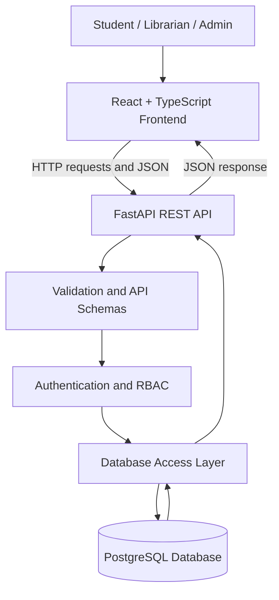
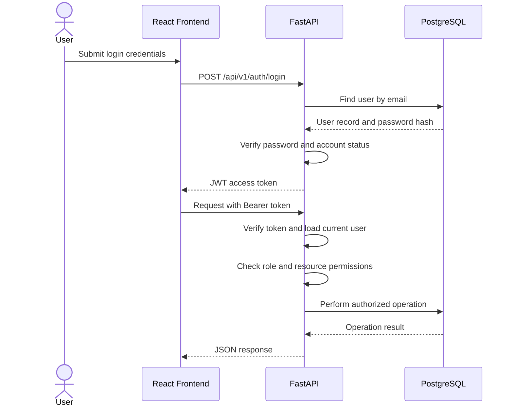
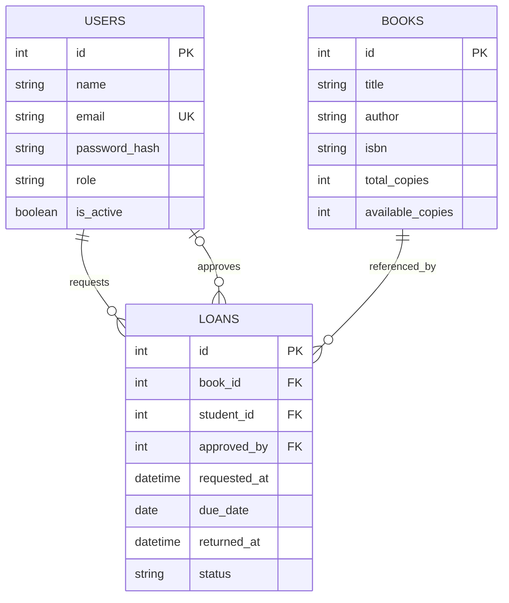

# Technical Design Document (TDD) — LibraryNest

| **Field**    | **Value**                                                                                                |
| ------------ | -------------------------------------------------------------------------------------------------------- |
| Product      | LibraryNest                                                                                              |
| Version      | MVP + Beta                                                                                               |
| Releases     | MVP — Mid-term, Beta — Final                                                                             |
| Status       | Draft                                                                                                    |
| Related docs | [Product Requirements Document (PRD)](01-prd.md), [Software Requirements Specification (SRS)](02-srs.md) |

Sections and tables are marked **MVP** or **Beta**. The MVP focuses on book management and discovery. The Beta release extends the system with authentication, role-based access control, and borrowing management.

## Documents in This Set

| Short form | Full form                           | Purpose                                                           | File        |
| ---------- | ----------------------------------- | ----------------------------------------------------------------- | ----------- |
| PRD        | Product Requirements Document       | What we build and why                                             | `01-prd.md` |
| SRS        | Software Requirements Specification | Functional requirements, permissions, and acceptance criteria     | `02-srs.md` |
| TDD        | Technical Design Document           | Architecture, database design, APIs, and implementation decisions | `03-tdd.md` |

## 1. Overview

LibraryNest is a web-based library management system that allows users to discover books and enables authorized staff to manage library resources and borrowing activities.

* **MVP — Mid-term:** Implement book CRUD operations, search by title or author, database integration, input validation, error handling, and basic frontend-backend integration.
* **Beta — Final:** Extend the MVP with user registration and login, JWT authentication, role-based access control (RBAC), student borrowing requests and loan history, librarian approval and return management, and administrator user and role management.

The frontend communicates with the backend through REST APIs. The backend validates requests, checks permissions, and performs database operations.

## 2. Technology Stack

| Layer               | Technology                                                | Purpose                                             | Release  |
| ------------------- | --------------------------------------------------------- | --------------------------------------------------- | -------- |
| Frontend            | React.js + TypeScript                                     | User interface and client-side interactions         | MVP      |
| Frontend tooling    | Vite                                                      | Development server and production build             | MVP      |
| Backend             | FastAPI                                                   | REST API, request validation, and API documentation | MVP      |
| Database            | PostgreSQL                                                | Persistent storage for books, users, and loans      | MVP      |
| ORM                 | SQLAlchemy                                                | Database queries and model persistence              | MVP      |
| Data validation     | Pydantic                                                  | Request and response validation                     | MVP      |
| API format          | JSON over HTTP                                            | Frontend-backend communication                      | MVP      |
| Authentication      | JWT access tokens                                         | Authenticated API access                            | Beta     |
| Password hashing    | Argon2 through a suitable Python password-hashing library | Secure password storage                             | Beta     |
| Authorization       | FastAPI dependencies and RBAC                             | Enforce role and resource permissions               | Beta     |
| Database migrations | Alembic                                                   | Version-controlled schema changes                   | Beta     |
| Version control     | Git and GitHub                                            | Source control and collaboration                    | MVP      |
| Testing             | Pytest and frontend testing tools                         | Verify API behavior and interface functionality     | MVP/Beta |

**Technology decision:** Use PostgreSQL as the primary database and SQLAlchemy for database access. Use Alembic when schema migrations become necessary. Exact dependency versions and deployment configuration will be recorded during implementation.

## 3. System Architecture

LibraryNest uses a client-server architecture. The React frontend sends HTTP requests to the FastAPI backend, which validates requests, applies authorization rules, and accesses PostgreSQL.



In the MVP, authentication and RBAC are not required for the initial book-management demonstration unless the course rubric requires them earlier. In the Beta release, protected endpoints require authentication and enforce role and resource-level permissions.

### 3.1 Request Flow — MVP

1. A user opens the React application.
2. The user searches for a book or submits a book-management form.
3. The frontend sends a request to the corresponding FastAPI endpoint.
4. FastAPI validates the request using Pydantic schemas.
5. The backend performs the required database operation through SQLAlchemy.
6. FastAPI returns a JSON response with an appropriate HTTP status code.
7. The frontend displays the result or an error message.

### 3.2 Authentication and Authorization Flow — Beta



The frontend may hide controls that a role cannot use, but the backend remains responsible for enforcing every permission. Frontend-only restrictions are not considered security controls.

## 4. Project Structure

The project will use separate frontend and backend directories.

```text
LibraryNest/
├── frontend/
│   ├── src/
│   │   ├── components/
│   │   ├── pages/
│   │   ├── services/
│   │   │   └── api.ts
│   │   ├── types/
│   │   ├── App.tsx
│   │   └── main.tsx
│   ├── package.json
│   └── vite.config.ts
├── backend/
│   ├── app/
│   │   ├── main.py
│   │   ├── database.py
│   │   ├── models.py
│   │   ├── schemas.py
│   │   ├── dependencies.py
│   │   ├── security.py
│   │   └── routers/
│   │       ├── books.py
│   │       ├── auth.py
│   │       ├── users.py
│   │       └── loans.py
│   ├── requirements.txt
│   └── alembic/
├── docs/
│   ├── 01-prd.md
│   ├── 02-srs.md
│   └── 03-tdd.md
└── README.md
```

**Implementation notes:**

* `main.py` initializes FastAPI and registers routers.
* `database.py` manages the database engine and session dependency.
* `models.py` contains SQLAlchemy database models.
* `schemas.py` contains request and response schemas.
* `dependencies.py` provides shared dependencies, including the current-user and role checks in Beta.
* `security.py` handles password hashing and JWT operations in Beta.
* `routers/` contains API endpoints grouped by resource.
* `services/api.ts` centralizes frontend API requests.

Keep route handlers focused on request validation, permission checks, and coordinating database operations. A separate service layer may be introduced if the application becomes more complex.

## 5. Database Design

### 5.1 Book Table — MVP

The `books` table stores the library's book catalogue.

| Column             | Type         | Rules                                                 |
| ------------------ | ------------ | ----------------------------------------------------- |
| `id`               | Integer      | Primary key, auto-increment                           |
| `title`            | VARCHAR(200) | Required                                              |
| `author`           | VARCHAR(150) | Required                                              |
| `isbn`             | VARCHAR(20)  | Optional; unique when provided                        |
| `description`      | TEXT         | Optional                                              |
| `category`         | VARCHAR(100) | Optional                                              |
| `total_copies`     | Integer      | Required; non-negative                                |
| `available_copies` | Integer      | Required; non-negative and cannot exceed total copies |
| `created_at`       | Timestamp    | Required                                              |
| `updated_at`       | Timestamp    | Required                                              |

Book titles and author names will be trimmed before validation. Search will support partial matches on title and author, without requiring an exact match.

### 5.2 Full Data Model — Beta

The Beta release introduces user accounts and loan records.

**`users`**

| Column          | Type         | Rules                                        |
| --------------- | ------------ | -------------------------------------------- |
| `id`            | Integer      | Primary key, auto-increment                  |
| `name`          | VARCHAR(100) | Required                                     |
| `email`         | VARCHAR(254) | Required and unique; normalized to lowercase |
| `password_hash` | VARCHAR      | Required; stores the password hash only      |
| `role`          | VARCHAR(20)  | `student`, `librarian`, or `admin`           |
| `is_active`     | Boolean      | Required; defaults to `true`                 |
| `created_at`    | Timestamp    | Required                                     |
| `updated_at`    | Timestamp    | Required                                     |

**`loans`**

| Column         | Type        | Rules                                                       |
| -------------- | ----------- | ----------------------------------------------------------- |
| `id`           | Integer     | Primary key, auto-increment                                 |
| `book_id`      | Integer     | Foreign key referencing `books.id`                          |
| `student_id`   | Integer     | Foreign key referencing `users.id`                          |
| `approved_by`  | Integer     | Nullable foreign key referencing `users.id`                 |
| `requested_at` | Timestamp   | Required                                                    |
| `approved_at`  | Timestamp   | Nullable                                                    |
| `due_date`     | Date        | Nullable until approval, if applicable                      |
| `returned_at`  | Timestamp   | Nullable                                                    |
| `status`       | VARCHAR(20) | `pending`, `approved`, `rejected`, `returned`, or `overdue` |

**Relationships**

* One user can have multiple loan records.
* One book can appear in multiple loan records over time.
* Each loan references one book and one student.
* `approved_by` records the librarian responsible for approval, when applicable.



**Database rules**

* Email addresses must be unique after normalization.
* A loan must reference an existing book and student.
* A book's available copy count cannot be negative or exceed its total copies.
* Loan approval and return operations must update loan status and book availability consistently.
* The backend must prevent concurrent approvals from borrowing the same last available copy.
* The database schema will be updated through Alembic migrations in Beta.

## 6. API Design

Base path: `/api/v1`

All request and response bodies use JSON unless otherwise stated. The frontend communicates with the backend through REST APIs.

### 6.1 Book Endpoints — MVP

| Method   | Endpoint                      | Purpose                   | Success response | Common errors       |
| -------- | ----------------------------- | ------------------------- | ---------------- | ------------------- |
| `POST`   | `/api/v1/books`               | Create a book             | `201 Created`    | `409`, `422`        |
| `GET`    | `/api/v1/books`               | List books                | `200 OK`         | `422`               |
| `GET`    | `/api/v1/books/{book_id}`     | Get book details          | `200 OK`         | `404`               |
| `PATCH`  | `/api/v1/books/{book_id}`     | Update book details       | `200 OK`         | `404`, `409`, `422` |
| `DELETE` | `/api/v1/books/{book_id}`     | Delete a book             | `204 No Content` | `404`, `409`        |
| `GET`    | `/api/v1/books?search=python` | Search by title or author | `200 OK`         | `422`               |
| `GET`    | `/api/health`                 | Check API availability    | `200 OK`         | —                   |

The list endpoint supports optional pagination and search parameters, for example:

`GET /api/v1/books?search=python&offset=0&limit=20`

For the MVP demonstration, the backend will validate inputs and handle duplicate ISBN values. Book deletion will be rejected when existing loan records require the book to be retained.

### 6.2 Authentication and Profile Endpoints — Beta

| Method  | Endpoint                | Purpose                                       | Access              |
| ------- | ----------------------- | --------------------------------------------- | ------------------- |
| `POST`  | `/api/v1/auth/register` | Register a student account                    | Public              |
| `POST`  | `/api/v1/auth/login`    | Authenticate a user and issue an access token | Public              |
| `GET`   | `/api/v1/users/me`      | View the current user's profile               | Authenticated users |
| `PATCH` | `/api/v1/users/me`      | Update permitted profile fields               | Authenticated users |

Public registration must not allow a user to choose the `librarian` or `admin` role. Privileged roles are assigned by an authorized administrator.

### 6.3 Loan Endpoints — Beta

| Method  | Endpoint                          | Purpose                             | Access    |
| ------- | --------------------------------- | ----------------------------------- | --------- |
| `POST`  | `/api/v1/loans`                   | Request to borrow a book            | Student   |
| `GET`   | `/api/v1/loans/me`                | View the student's own loan history | Student   |
| `GET`   | `/api/v1/loans`                   | View and filter loan requests       | Librarian |
| `PATCH` | `/api/v1/loans/{loan_id}/approve` | Approve a pending request           | Librarian |
| `PATCH` | `/api/v1/loans/{loan_id}/reject`  | Reject a pending request            | Librarian |
| `PATCH` | `/api/v1/loans/{loan_id}/return`  | Record a returned book              | Librarian |

Loan endpoints must validate the current loan status before applying a transition. A request cannot be approved twice, and a rejected or already returned loan cannot be approved again.

The loan duration and maximum number of active loans per student will follow the finalized SRS and be confirmed before implementation.

### 6.4 User and Role Management — Beta

| Method  | Endpoint                               | Purpose                           | Access |
| ------- | -------------------------------------- | --------------------------------- | ------ |
| `GET`   | `/api/v1/admin/users`                  | List users                        | Admin  |
| `GET`   | `/api/v1/admin/users/{user_id}`        | View a user's details             | Admin  |
| `PATCH` | `/api/v1/admin/users/{user_id}/role`   | Change a user's role              | Admin  |
| `PATCH` | `/api/v1/admin/users/{user_id}/status` | Activate or deactivate an account | Admin  |

Administrative endpoints must reject requests from non-admin users. The backend must prevent users from granting themselves elevated roles.

### 6.5 Request and Response Examples

**Create a book — MVP**

Request:

```http
POST /api/v1/books
Content-Type: application/json
```

```json
{
  "title": "Introduction to Algorithms",
  "author": "Thomas H. Cormen",
  "isbn": "9780262046305",
  "category": "Computer Science",
  "total_copies": 5
}
```

Example response:

```json
{
  "id": 1,
  "title": "Introduction to Algorithms",
  "author": "Thomas H. Cormen",
  "isbn": "9780262046305",
  "category": "Computer Science",
  "total_copies": 5,
  "available_copies": 5
}
```

**Request to borrow a book — Beta**

```http
POST /api/v1/loans
Authorization: Bearer <access_token>
Content-Type: application/json
```

```json
{
  "book_id": 1
}
```

The backend verifies the student's identity, confirms that the book exists and can be requested, and creates a pending loan request. The available-copy count is adjusted according to the finalized loan policy; it must never be decremented more than once for a single approved loan.

### 6.6 Error Handling

Use appropriate HTTP status codes and a consistent JSON error structure.

| Status                      | Meaning                                                   |
| --------------------------- | --------------------------------------------------------- |
| `400 Bad Request`           | Invalid operation or state transition                     |
| `401 Unauthorized`          | Missing or invalid authentication                         |
| `403 Forbidden`             | Authenticated user lacks permission                       |
| `404 Not Found`             | Resource does not exist or must be hidden from the caller |
| `409 Conflict`              | Duplicate ISBN/email or conflicting resource state        |
| `422 Unprocessable Entity`  | Input validation failed                                   |
| `500 Internal Server Error` | Unexpected server-side error                              |

Example:

```json
{
  "detail": "Book not found"
}
```

FastAPI's validation responses may include field-level error details. Unexpected internal errors must be logged securely without exposing stack traces, credentials, password hashes, or tokens to clients.

### 6.7 API Design Rules

* Use plural resource names such as `/books`, `/users`, and `/loans`.
* Use `POST` for creation, `GET` for retrieval, `PATCH` for partial updates, and `DELETE` for deletion.
* Validate all request data on the backend.
* Use response schemas to control which fields are returned.
* Do not expose `password_hash` or other internal security fields.
* Use pagination for list endpoints that may return many records.
* Apply role and resource ownership checks to every protected endpoint.
* Return consistent status codes and error responses.

## 7. Database Access

* `database.py` creates the SQLAlchemy engine using the `DATABASE_URL` environment variable.
* A FastAPI dependency provides a database session for each request and closes it after use.
* Database operations must commit successful changes and roll back failed transactions.
* Database credentials must not be hard-coded in the source code.
* Development and production databases must use separate credentials and appropriate access controls.
* Alembic manages schema changes in Beta.
* Database constraints and transaction handling complement application-level validation; they do not replace it.

## 8. Configuration

| Variable               | Purpose                                                           | Release  |
| ---------------------- | ----------------------------------------------------------------- | -------- |
| `DATABASE_URL`         | Database connection string                                        | MVP      |
| `JWT_SECRET`           | Secret used to sign and verify JWT access tokens                  | Beta     |
| `ACCESS_TOKEN_MINUTES` | Access-token lifetime                                             | Beta     |
| `CORS_ORIGINS`         | Allowed frontend origins for local or separate-origin deployments | MVP/Beta |
| `ENVIRONMENT`          | Distinguishes development and production settings                 | MVP      |

Configuration rules:

* Store secrets in local environment variables or a protected environment file.
* Add `.env` to `.gitignore`.
* Provide a `.env.example` containing placeholder values only.
* Never commit real database passwords, JWT secrets, or production credentials.
* Configure CORS only for the frontend origins that need access to the API.

## 9. Frontend-Backend Integration

The React frontend will use a centralized API service to communicate with FastAPI.

The `services/api.ts` module will:

* Define the API base URL.
* Send HTTP requests and JSON bodies.
* Parse successful responses.
* Handle validation and server errors.
* Include an access token in the `Authorization` header for protected Beta endpoints.

Frontend pages and components will be organized around the main workflows:

| Page or component      | Purpose                              | Release |
| ---------------------- | ------------------------------------ | ------- |
| Book List              | Display books                        | MVP     |
| Book Search            | Search by title or author            | MVP     |
| Book Form              | Add or update book information       | MVP     |
| Book Details           | Display selected book information    | MVP     |
| Login and Registration | Authenticate users                   | Beta    |
| Student Dashboard      | View books and personal loan history | Beta    |
| Borrowing Requests     | Request to borrow a book             | Beta    |
| Librarian Dashboard    | Review requests and manage returns   | Beta    |
| Admin Dashboard        | Manage users and roles               | Beta    |

The frontend must display loading, success, empty, and error states where relevant. It must not assume that an operation succeeded until the backend returns a successful response.

## 10. Authentication and RBAC — Beta

### 10.1 Authentication

* Passwords are stored as secure Argon2 hashes, never as plaintext.
* Login verifies the supplied password against the stored hash.
* Successful login issues a signed JWT access token with a limited lifetime.
* Protected requests send the token using `Authorization: Bearer <access_token>`.
* The backend verifies the token and loads the current user before performing protected operations.
* Invalid, expired, or missing tokens result in `401 Unauthorized`.
* Account status is checked before allowing protected actions.

The initial implementation will use short-lived access tokens. Refresh tokens, password-reset workflows, and other advanced authentication features will only be added if required by the approved requirements or available implementation time.

### 10.2 Role-Based Access Control

LibraryNest uses three global roles.

| Permission                 | Student | Librarian | Admin                       |
| -------------------------- | ------- | --------- | --------------------------- |
| View and search books      | Yes     | Yes       | Yes                         |
| Create or edit books       | No      | Yes       | Yes                         |
| Delete books               | No      | Yes       | Yes                         |
| Request to borrow a book   | Yes     | No        | No                          |
| View own loan history      | Yes     | No        | No                          |
| Review borrowing requests  | No      | Yes       | Yes, if permitted by policy |
| Approve or reject requests | No      | Yes       | Yes, if permitted by policy |
| Record book returns        | No      | Yes       | Yes, if permitted by policy |
| View and manage users      | No      | No        | Yes                         |
| Assign user roles          | No      | No        | Yes                         |

The final permission matrix must match the approved SRS. If the SRS limits loan management strictly to librarians, admin access must not be added without updating the requirements.

### 10.3 Permission Enforcement

FastAPI dependencies will provide shared authentication and role checks, such as:

* `get_current_user`: verifies the token and loads the current user.
* `require_student`: allows student-only actions.
* `require_librarian`: allows librarian-only actions.
* `require_admin`: allows administrative actions.

These checks are applied on the backend for every relevant endpoint. The frontend is not trusted to enforce access control by itself.

The backend must also validate the requested resource and current state. For example, a student can view only their own loan history, and a librarian can approve only an eligible pending request.

## 11. Security Design — Beta

| Area             | Design                                                             |
| ---------------- | ------------------------------------------------------------------ |
| Password storage | Argon2 password hashing                                            |
| Authentication   | Signed, short-lived JWT access tokens                              |
| Authorization    | Server-side RBAC checks                                            |
| Input validation | Pydantic schemas and database constraints                          |
| SQL injection    | Parameterized SQLAlchemy queries                                   |
| Data exposure    | Explicit response schemas                                          |
| Secrets          | Environment variables, never committed to Git                      |
| Account roles    | Privileged roles assigned only by an authorized administrator      |
| Loan integrity   | Transactions and status validation                                 |
| Errors           | Generic unexpected-error responses; sensitive details stay in logs |
| Transport        | HTTPS in production                                                |
| CORS             | Restrict to approved frontend origins                              |

Security requirements will be verified with both authorized and unauthorized requests. Hiding a button in the UI is not sufficient evidence that an API endpoint is protected.

## 12. Testing Strategy

Testing will be performed incrementally throughout development.

### 12.1 MVP Tests

* Create a book with valid input.
* Reject missing titles or authors.
* Reject invalid copy counts.
* Search by partial title and author.
* Retrieve an existing book and return `404` for a missing book.
* Update a book and verify the stored changes.
* Delete a book and verify that it is no longer returned.
* Handle duplicate ISBN values correctly.
* Verify that the frontend displays API responses and errors correctly.

### 12.2 Beta Tests

* Register a student with a valid email and password.
* Reject duplicate email addresses and invalid registration data.
* Verify successful and unsuccessful login.
* Reject protected requests without a valid token.
* Verify that students cannot access librarian-only or admin-only actions.
* Verify that users cannot view other students' loan histories.
* Test loan approval, rejection, and return transitions.
* Verify that book availability remains consistent after loan operations.
* Verify that only admins can change user roles.
* Verify that inactive accounts cannot perform protected actions.

Automated tests will be added where practical. API tests should use a dedicated test database or isolated test configuration rather than production data.

## 13. Deployment

The frontend and backend may be deployed as separate services, provided that the frontend is configured to call the correct backend API URL and the backend permits the intended frontend origin.

The deployment plan is:

1. Store the project source code in GitHub.
2. Configure the frontend build and backend startup commands for the selected hosting platforms.
3. Provision PostgreSQL and configure `DATABASE_URL`.
4. Configure production environment variables and secrets.
5. Apply database migrations before deploying code that depends on schema changes.
6. Verify the health endpoint and core API workflows.
7. Test authentication, role restrictions, and frontend-backend integration before the final demonstration.

The final hosting provider and deployment configuration will be confirmed during implementation. Local development must remain possible without production credentials.

## 14. Risks and Mitigations

| Risk                                               | Mitigation                                                           |
| -------------------------------------------------- | -------------------------------------------------------------------- |
| Unauthorized users access protected endpoints      | Enforce RBAC in FastAPI dependencies and test direct API requests    |
| Duplicate accounts or ISBN values                  | Use normalization, validation, and database uniqueness constraints   |
| Available-copy counts become incorrect             | Use database transactions and validate loan state transitions        |
| Frontend and backend contracts become inconsistent | Maintain request/response schemas and test integration               |
| Database credentials are exposed                   | Use environment variables and `.gitignore`                           |
| Scope becomes too large                            | Complete MVP requirements before implementing Beta features          |
| Database schema changes break existing data        | Use reviewed Alembic migrations and backups where appropriate        |
| Deployment configuration differs from local setup  | Document environment variables and test the deployed health endpoint |

## 15. Implementation Plan

| Phase         | Main tasks                                            | Deliverable                   |
| ------------- | ----------------------------------------------------- | ----------------------------- |
| MVP — Step 1  | Initialize React, TypeScript, FastAPI, and PostgreSQL | Running project skeleton      |
| MVP — Step 2  | Implement book models, schemas, and CRUD endpoints    | Working book REST API         |
| MVP — Step 3  | Implement title/author search and validation          | Searchable book catalogue     |
| MVP — Step 4  | Integrate React pages with the backend                | Working frontend-backend flow |
| MVP — Step 5  | Test endpoints, error handling, and core workflows    | Mid-term MVP demonstration    |
| Beta — Step 1 | Implement registration, login, and JWT authentication | Authenticated user access     |
| Beta — Step 2 | Implement roles and permission dependencies           | RBAC-protected endpoints      |
| Beta — Step 3 | Implement borrowing requests and loan history         | Student borrowing workflow    |
| Beta — Step 4 | Implement librarian approval and return management    | Library circulation workflow  |
| Beta — Step 5 | Implement admin user and role management              | Administrative workflow       |
| Beta — Step 6 | Test security, data consistency, and integration      | Final Beta demonstration      |

## 16. Open Design Decisions

The following details must be confirmed against the final SRS and implementation constraints:

* Whether book deletion is allowed when historical loan records exist.
* Whether a student can have multiple active loans for the same book.
* The loan duration and maximum number of active loans.
* Whether available copies are reserved at request time or approval time.
* Whether administrators can approve loans or manage circulation directly.
* The production hosting provider and database configuration.
* The required automated test coverage and deployment expectations.

These decisions should be resolved before the corresponding features are implemented. The implementation must follow the finalized requirements rather than introduce extra features that are outside the approved project scope.
